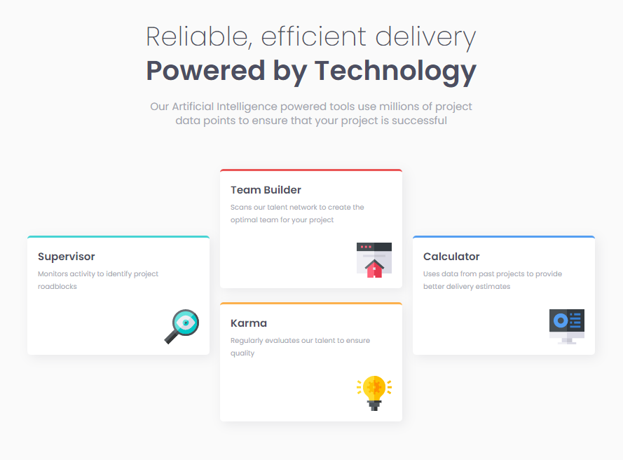

# Frontend Mentor - Four card feature section solution

This is a solution to the [Four card feature section challenge on Frontend Mentor](https://www.frontendmentor.io/challenges/four-card-feature-section-weK1eFYK). Frontend Mentor challenges help you improve your coding skills by building realistic projects.

## Table of contents

- [Overview](#overview)
  - [The challenge](#the-challenge)
  - [Screenshot](#screenshot)
  - [Links](#links)
- [My process](#my-process)
  - [Built with](#built-with)
  - [What I learned](#what-i-learned)
- [Author](#author)
- [Acknowledgments](#acknowledgments)

## Overview

### The challenge

Users should be able to:

- View the optimal layout for the site depending on their device's screen size

### Screenshot



### Links

- Live Site URL: [Add live site URL here](https://fourcardfeature-suatcg.netlify.app/)

## My process

### Built with

- Semantic HTML5 markup
- CSS custom properties
- Flexbox
- CSS Grid
- Desktop-first workflow

### What I learned

I've done a practice to responsiveness via HTML, CSS, as well as media queries, which helped me out, see some cool effects, especially when I was using the grid and flex templates. I divided into boxes different scales via grid and centered all over the page. In addition, I've learned to adjacent corner flex-items, whereby given to auto margin two sides, it could reside to corner without any changes its size. In this case, I gave it to the image items like the below code snippet, as you can see:

```css
.mini-cell img {
  margin-left: auto;
  margin-top: auto;
  width: 5rem;
  height: 5rem;
}
```

## Author

- Frontend Mentor - [@suatcg](https://www.frontendmentor.io/profile/suatcg)
- Twitter - [@suatcg](https://twitter.com/suatcg)

## Acknowledgments

If I made any mistake, you would contribute your ideas that make me proud and improve my knowledge.
